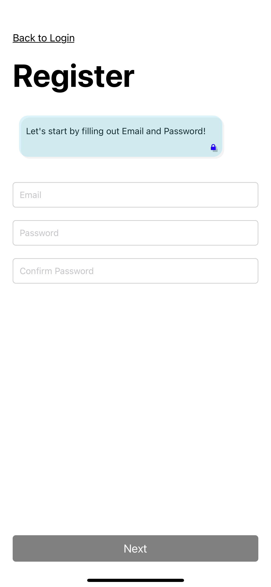
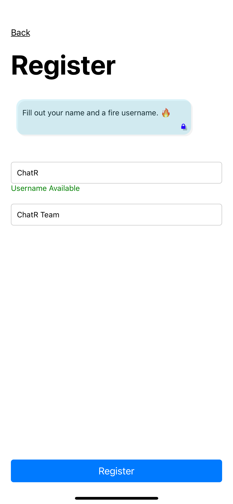
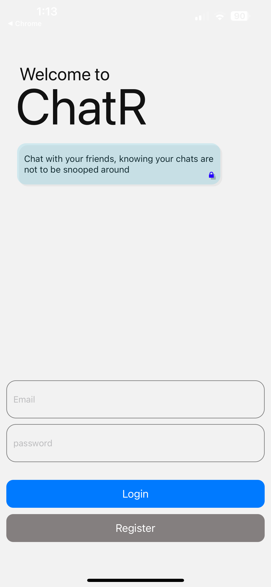
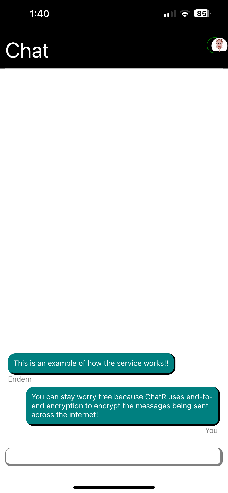

# ChatR

A way to chat with everyone in an encrypted manner. 

## Technologies used

**Client:** React, Node, expo go

**Server:** Appwrite

### Additional Technologies

- Javascript, Typescript
- Appwrite
- end-to-end encryption 

## Usage/Examples
Create an Account: Get Started by clicking on Create an Account then fill out necessary information.

  
  

Login: Login to the account by providing email and password.

Start chatting with people

## Author

- Hussain Merchant - mhussum@gmail.com

## Deployment

To deploy this project, download the apk from release. 

